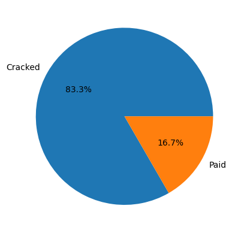
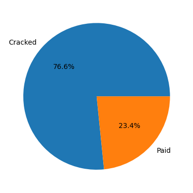
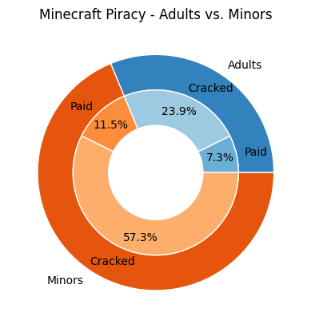
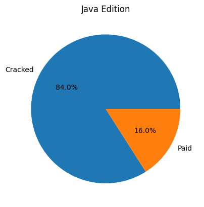
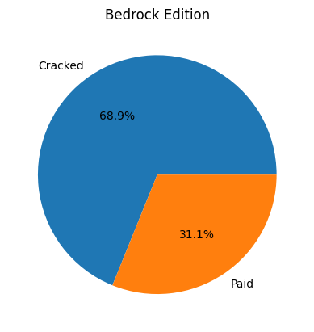
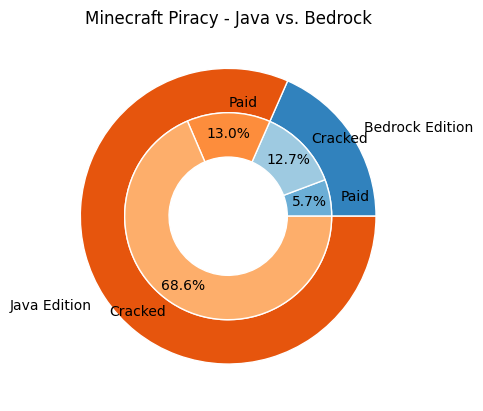

# Overview

Learning the `pandas` Python library by analyzing [a dataset on Minecraft piracy](https://www.kaggle.com/datasets/priyanshusethi/minecraft-piracy-dataset) that was uploaded to Kaggle.com by Priyanshu Sethi.

[Software Demo Video](https://www.youtube.com/watch?v=5OT2E3pOBoE)

# Data Analysis Results

I used [a Jupyter notebook, accessible here,](main.ipynb) to find and report on the results.

Summary of the results if you don't want to read the notebook

#### Mom's credit card or crime? How many under-18s paid?
|Cracked|Paid|
|-|-|
|800|160|

#### What about the rest (adults)?
|Cracked|Paid|
|-|-|
|334|102|

#### Let's put it all together.
| &nbsp; | Cracked | Paid |
|-|-|-|
|Minors|800|160|
|Adults|334|102|

#### Which edition (Java/Bedrock) is pirated more?
| &nbsp; | Cracked | Paid |
|-|-|-|
|Java|957|182|
|Bedrock|177|80|

 

# Development Environment

Python 3.11.3 with `pandas` 2.0.1 and `matplotlib.pyplot`. Notebook made in VS Code with the [Jupyter](https://marketplace.visualstudio.com/items?itemName=ms-toolsai.jupyter) extension.

# Useful Websites

* [W3Schools tutorial I followed](https://www.w3schools.com/python/pandas/default.asp)
* [pandas homepage and documentation](https://pandas.pydata.org/)
* [Pyplot documentation/tutorial](https://matplotlib.org/stable/tutorials/introductory/pyplot.html)

# Future Work

I consider this complete, but I could always ask more questions, do more data visualization, or do this to more datasets.